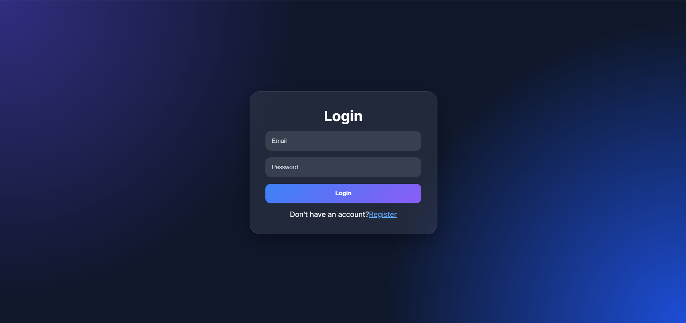
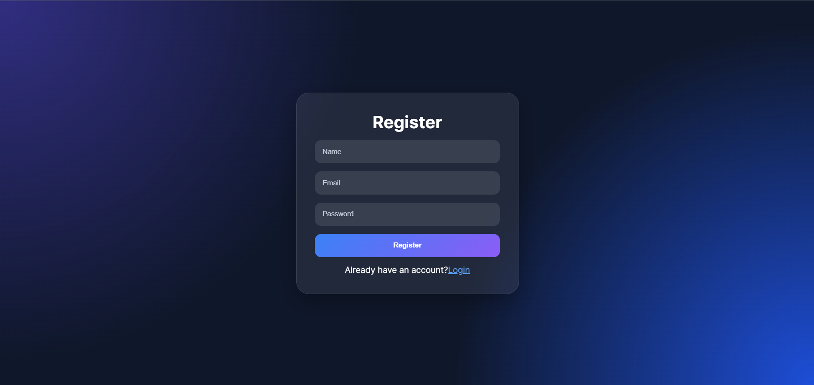
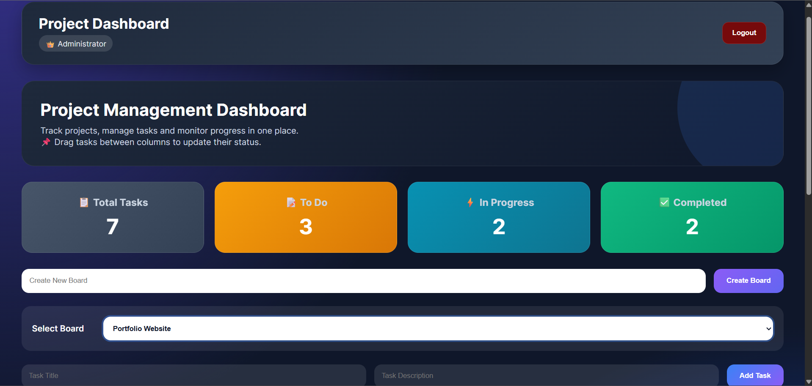
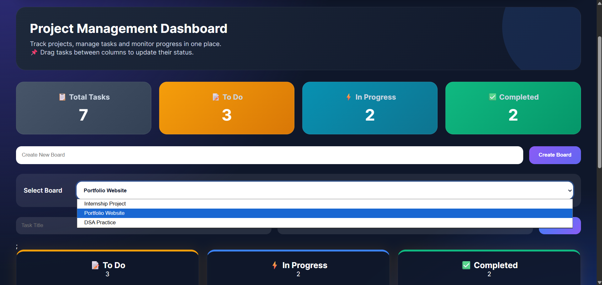
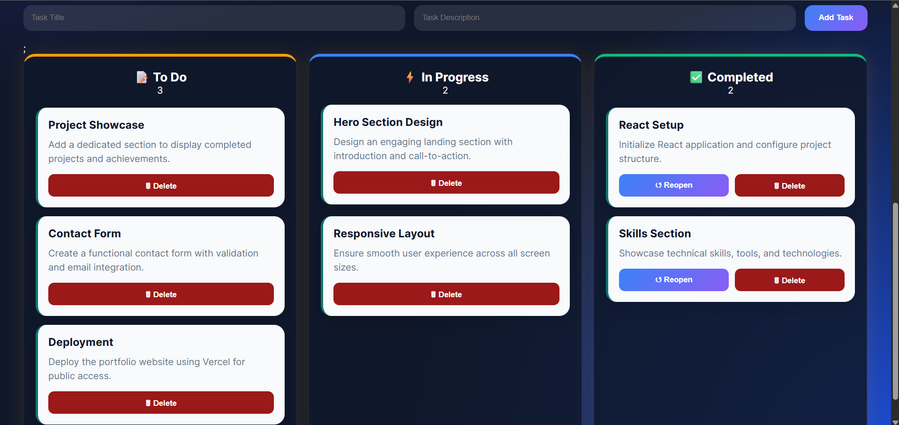
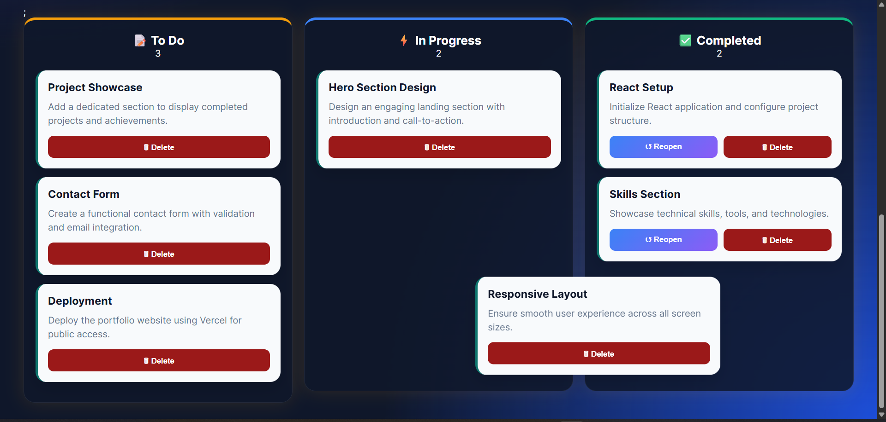
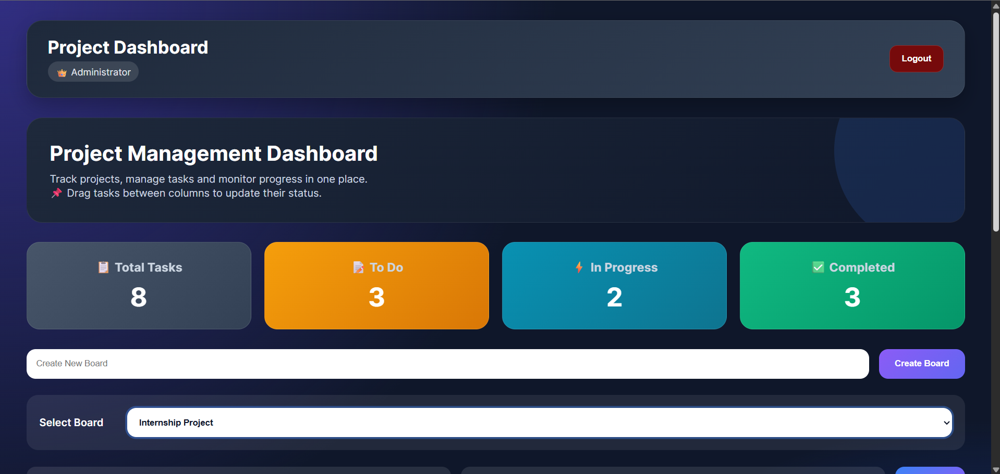
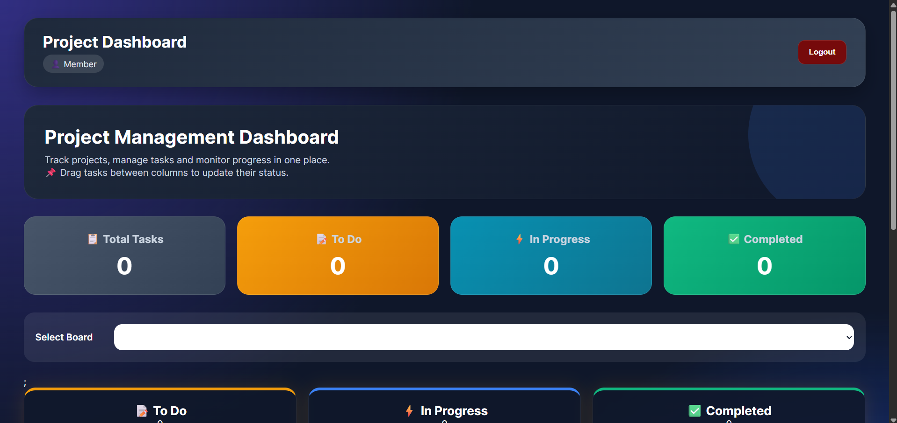

# Project Management Dashboard

A full-stack Project Management Dashboard built using the MERN Stack (MongoDB, Express.js, React.js, Node.js). The application enables users to manage projects through boards and tasks, organize workflows using a Kanban-style interface, and securely access data through JWT authentication and role-based access control.

---

## Features

### Authentication & Security
- User Registration
- User Login
- JWT Authentication
- Protected Routes
- Secure Password Hashing using bcrypt

### Board Management
- Create Project Boards
- View Available Boards
- Switch Between Boards

### Task Management
- Create Tasks
- Delete Tasks
- Update Task Status
- Organize Tasks by Board

### Kanban Workflow
- To Do
- In Progress
- Completed

### Drag & Drop
- Move tasks seamlessly between workflow columns using drag-and-drop functionality.

### Role-Based Access Control

#### Admin
- Create Boards
- Create Tasks
- Manage Task Workflow

#### Member
- View Boards
- View Tasks
- Update Task Status

### Data Persistence
- MongoDB Atlas Integration
- Persistent Storage for Users, Boards, and Tasks

---

## Tech Stack

### Frontend
- React.js
- React Router DOM
- Axios
- @hello-pangea/dnd
- CSS3

### Backend
- Node.js
- Express.js
- JWT
- bcryptjs

### Database
- MongoDB Atlas
- Mongoose

---

## Project Structure

```text
project-management-dashboard/

├── client/
│   ├── src/
│   ├── public/
│   └── package.json
│
├── server/
│   ├── middleware/
│   ├── models/
│   ├── routes/
│   ├── package.json
│   └── .env
│
├── screenshots/
│
├── .gitignore
└── README.md
```

---

## Installation

### Clone Repository

```bash
git clone https://github.com/Prerana43/project-management-dashboard.git
```

### Backend Setup

```bash
cd server
npm install
npm start
```

### Frontend Setup

```bash
cd client
npm install
npm run dev
```

---

## Environment Variables

Create a `.env` file inside the `server` directory.

```env
PORT=5000
MONGO_URI=your_mongodb_connection_string
JWT_SECRET=your_secret_key
```

---

## Application Screenshots

### Login Page



---

### Register Page



---

### Dashboard Overview



---

### Board Management



---

### Task Creation



---

### Drag & Drop Functionality



---

### Admin Access



---

### Member Access



---

## Key Learning Outcomes

- JWT Authentication and Authorization
- Protected API Routes
- Role-Based Access Control
- MongoDB Data Modeling
- REST API Development
- React State Management
- Drag-and-Drop Functionality
- Full-Stack MERN Development
- Responsive UI Design

---

## Future Improvements

- Task Assignment to Team Members
- Due Dates and Deadlines
- Activity Logs
- Board Sharing
- File Attachments
- Dark/Light Theme Toggle

---

## Author

**Prerana Nishad**
